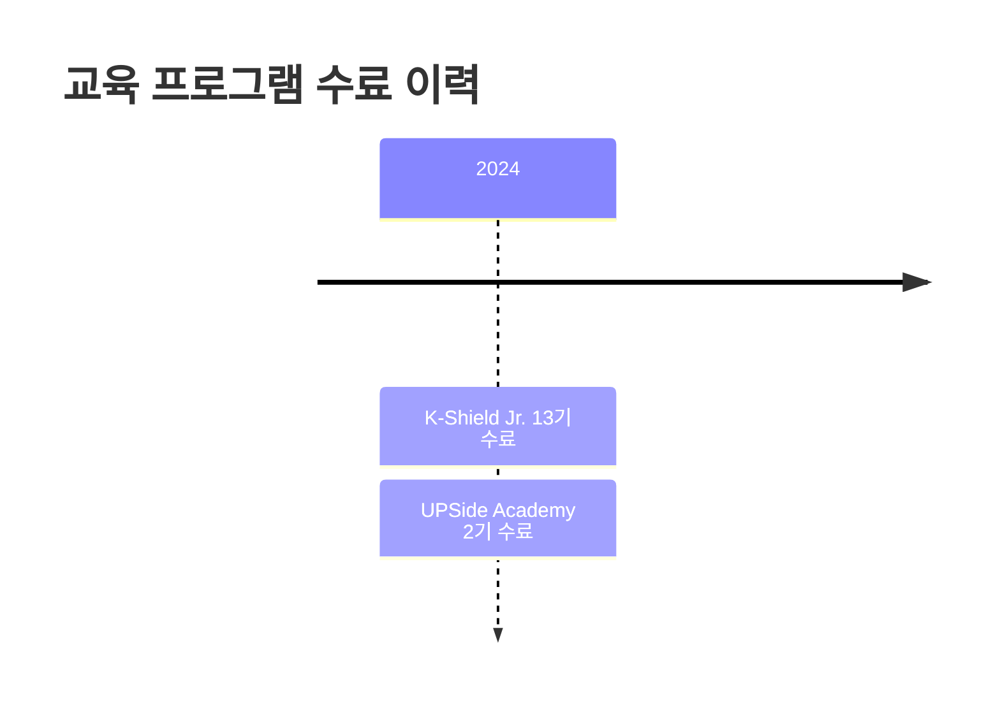

+++
author = "h3ind33r"
title = "학술 활동 및 수상 경력"
date = "2025-02-01"
description = "연구 논문, 수상 경력, 자격증 및 기타 활동 현황"
tags = [
    "research",
    "achievements",
    "awards",
    "forensics",
    "cybersecurity",
]
+++

## 📝 작성 논문 현황

### 완료된 연구 논문

| Year | Paper Title | Field |
|------|----------|------|
| 2024 | [Forensic Artifact Analysis of Windows OS-based Conversational AI Applications](/forensic-ai-application-analysis-2024.pdf) | Digital Forensics |
| 2025 | A Framework Proposal for Archiving Suspected Criminal Channels Using Telegram API | Cybercrime Investigation |

---

## 🏆 수상 경력

### 대외 수상

| 연도 | 주관 기관 | 수상 내역 | 비고 |
|------|----------|----------|------|
| 2022 | 사이버작전사령부 | Whitehat Contest 생도트랙 **우승** | 🥇 |
| 2024 | KISA | K-Shield Jr. 13기 우수사이버보안인력 선정 | 🎖️ |
| 2024 | 두나무 × 티오리 | UPSide Academy 2기 팀프로젝트 **우수상** | UDC 2025 컨퍼런스 발표권 획득 |

#### UPSide Academy 우수상 증빙

🔗 [UDC 2025 Program](https://udc.dunamu.com/udc2025/program/special)

### 수료 인증



- **2024** KISA 주관 "K-Shield Jr. 13기" 수료인증서
- **2024** 두나무×티오리 주관 "UPSide Academy 2기" 수료인증서

---

## 📜 공인 자격증

| 자격증명 | 등급 | 발급 기관 |
|---------|------|----------|
| 리눅스마스터 | 2급 | 한국정보통신진흥협회 |

---

## 🔬 연구 및 업무 활동

### 공공기관 활동

#### 서울경찰청 누리캅스 (사이버명예경찰)
- **기간**: 2023 - 2024
- **역할**: 사이버범죄 예방 및 온라인 치안 활동

---

### 주요 연구 프로젝트

#### 1. K-Shield Jr. 13기 - C.I.A. 연구팀 리더

**프로젝트 개요**
- **트랙**: 침해사고 분석
- **역할**: 연구팀 리더
- **기간**: 2024

**연구 주제**
> 유해 게시물 판별 특화 한국어 CIA-BERT™ 모델을 활용한 온라인 범죄 현장 아카이빙 자동화 도구 개발

**핵심 기술**
- 자연어 처리 (NLP)
- BERT 모델 커스터마이징
- 자동화 아카이빙 시스템
- 온라인 범죄 분석

---

#### 2. UPSide Academy 2기 - ChainStalker 연구팀 리더

**프로젝트 개요**
- **분야**: 블록체인 포렌식
- **역할**: 연구팀 리더
- **기간**: 2024

**연구 주제**
> Perp DEX를 통한 자금세탁 효용성 검증

**핵심 내용**
- 탈중앙화 거래소(DEX) 분석
- Perpetual 거래 메커니즘 연구
- 자금세탁 경로 추적 기법
- 블록체인 트랜잭션 분석

---

## 📊 활동 통계

### 연구 분야별 분포

| 분야 | 프로젝트 수 | 비중 |
|------|------------|------|
| Digital Forensics | 3 | 50% |
| Blockchain Security | 1 | 17% |
| Cybercrime Investigation | 2 | 33% |

### 주요 성과 타임라인

```
2022 ━━━━━━━━━━━━━━━━━━━━━━━━━━━━━━━━━━━━━━━━━━━━━━━━━ 2025
  │                    │                    │          │
  ▼                    ▼                    ▼          ▼
Whitehat          누리캅스              K-Shield    텔레그램
Contest           위촉                  Jr.         논문
우승                                    활동        완료
```

---

## 💡 전문 분야

- 🔍 **Digital Forensics**: AI 애플리케이션, 모바일 포렌식
- 🛡️ **Cybersecurity**: 침해사고 분석, 위협 인텔리전스
- ⛓️ **Blockchain Security**: DEX 분석, 자금추적
- 🤖 **AI/ML**: NLP, BERT 모델, 유해 콘텐츠 탐지

---

*Last Updated: February 2025*
